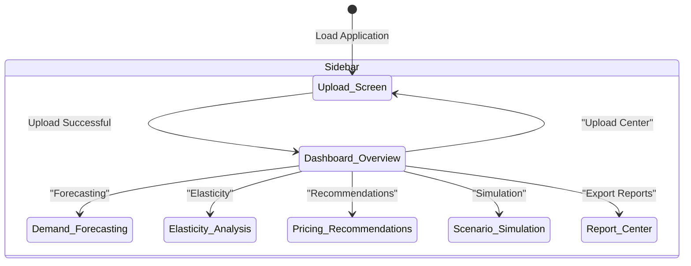

# App Flow Documentation
## Project: PriceSense Analytics (ML-Based Pricing Optimization & Recommendation System)

---

## 1. User Journey & Navigation Flow

The frontend is structured as a single-page application (SPA) with a persistent sidebar that enables navigation through different functional views.

---

## 2. Step-by-Step Functional Workflows

### 2.1 Step 1: Dataset Upload & Schema Mapping
1. **User Action**: The user logs in and lands on the **Upload Center** screen. They select a CSV/Excel sales dataset file.
2. **File Selection**: The frontend validates the file extension (`.csv`, `.xls`, `.xlsx`).
3. **Data Post**: The user clicks "Process Dataset". The client fires a multi-part form request to `/api/v1/upload/dataset`.
4. **API Acknowledgment**: The API returns an immediate acknowledgement with status `"processing"` and the `dataset_id`.

### 2.2 Step 2: Data Validation & Ingestion
The backend processes the file in memory:
1. **Header Normalization**: Columns are mapped against pre-defined aliases (e.g. `Selling Price`, `Price`, `Rate` -> `price`).
2. **Missing Checks**: If required columns (`product_name`, `price`, `units_sold`, `cost`, `date`) are absent, the ingestion halts, updating the database status of the dataset to `"failed"` and returning a detailed validation error message (e.g., `Missing required column: "units_sold"`).
3. **Rows Filtering**:
   - Filter out rows with empty product names.
   - Drop rows with negative prices or costs.
   - Drop rows with dates that fail to parse.
4. **Calculations**:
   - `revenue` is auto-calculated as `price * units_sold` if missing or mismatching by >1%.
   - `profit` is auto-calculated as `revenue - (cost * units_sold)`.

### 2.3 Step 3: Database Storage
1. **Products Insertion**: Unique products in the dataset are isolated. The database is checked; new items are added to the `products` table, while existing items are updated.
2. **Sales Transactions Insertion**: The cleaned sales records are mapped to their respective product IDs and bulk-saved into the `sales_data` table linked to the `dataset_id`.
3. **Completion Status**: The dataset status in SQLite is updated to `"processed"`. The frontend receives this update on polling, transitioning the status badge from yellow ("Processing") to green ("Processed").

### 2.4 Step 4: Dashboard Analytics Generation
1. **Navigation**: User clicks on "Dashboard Overview" in the sidebar.
2. **Frontend request**: Frontend fires a `GET` request to `/api/v1/dashboard/kpis` and `/api/v1/dashboard/charts`.
3. **SQL Aggregations**: The backend runs SQL operations:
   - `SUM(revenue)` and `SUM(profit)` from `sales_data`.
   - Calculates overall gross margin: `(total_profit / total_revenue) * 100`.
   - Counts distinct `product_id` values under active listings.
4. **Charts Rendering**: The backend returns arrays representing:
   - Sales trends over time (aggregated monthly or weekly).
   - Share of categories and regions.
   - Top 5 selling items by revenue.
   The frontend parses these JSON objects and plots interactive graphs using Chart.js or Plotly.js.

### 2.5 Step 5: Demand Forecasting
1. **Navigation**: User navigates to the **Forecasting** page and selects a product from a searchable dropdown.
2. **Fetch Request**: The UI requests `/api/v1/forecasting/demand/{product_id}`.
3. **ML Pipeline Execution**:
   - The backend checks if a forecast already exists. If not, it pulls historical `sales_data` for the product.
   - Features (`price`, `month`, `day_of_week`, `trend_index`) are engineered.
   - An ordinary least-squares linear regression model or random forest is trained on the data points.
   - The model predicts the demand for the next 30 days based on the current price.
4. **Render Forecast**: The backend responds with dates, predicted units, and $R^2$ scores. The frontend renders this forecast as a time-series line chart with a shaded confidence interval representing forecast variance.

### 2.6 Step 6: Elasticity Calculation
1. **Navigation**: User navigates to the **Elasticity** tab.
2. **Elasticity Endpoint**: The UI calls `/api/v1/pricing/elasticity/{product_id}`.
3. **PED Regression**:
   - Backend extracts log-transformed price and log-transformed quantity sold.
   - It fits a linear regression: $\ln(Q) = \beta_0 + \beta_1 \ln(P)$.
   - The slope $\beta_1$ is saved as the elasticity coefficient.
   - Classification rules are applied (e.g., Elastic if coefficient < -1).
4. **Curve Generation**: The API returns the coefficient, classification, and a series of historical (Price, Quantity) coordinates. The frontend plots these points as a scatter plot overlaid with the calculated regression line.

### 2.7 Step 7: Pricing Recommendations
1. **Navigation**: User clicks the **Recommendations** screen.
2. **Recommendations Endpoint**: The client makes a `GET` request to `/api/v1/pricing/recommendations`.
3. **Optimization Formula Application**:
   - For each product, the backend reads the estimated PED and marginal cost ($MC$).
   - If PED is inelastic ($\text{PED} > -1$), the system recommends raising the price (since demand won't drop significantly, increasing margins).
   - If PED is elastic ($\text{PED} < -1$), it recommends lowering the price to capture more sales volume and boost revenue.
   - It calculates the optimal theoretical price: $P^* = MC \times \frac{\text{PED}}{1 + \text{PED}}$.
4. **Impact Projection**: The engine estimates the shift:
   - Expected Volume Shift: $\% \Delta Q = \text{PED} \times \% \Delta P$.
   - Projections for Revenue and Profit changes are calculated.
5. **Presentation**: Recommendations are rendered in a clean grid showing: Product, Current Price, Recommended Price, Expected Impact %, and a text reason card.

### 2.8 Step 8: Scenario Simulation (What-If Analysis)
1. **Navigation**: User selects **Simulation** page.
2. **Interactive Slider**: The user selects a product and drags the price slider (e.g., simulating a 10% price drop).
3. **Post Simulation**: The client sends a `POST` request to `/api/v1/pricing/simulate` with `{ "product_id": "...", "simulated_price": 45.00 }`.
4. **Dynamic Elasticity Inference**:
   - Backend loads the product's PED and current baseline price.
   - It calculates the percentage change in price: $\% \Delta P = \frac{P_{new} - P_{old}}{P_{old}}$.
   - It derives the change in demand: $\% \Delta Q = \text{PED} \times \% \Delta P$.
   - It projects:
     - New Demand ($Q_{new} = Q_{old} \times (1 + \% \Delta Q)$)
     - New Revenue ($R_{new} = P_{new} \times Q_{new}$)
     - New Profit ($Profit_{new} = (P_{new} - MC) \times Q_{new}$)
5. **Display Changes**: The API returns the calculated values. The UI dynamically flashes green or red depending on whether the simulation increases or decreases total profits/revenues.

### 2.9 Step 9: Report Export
1. **Navigation**: User goes to **Export Center**.
2. **Report Options**: User clicks "Export PDF Summary" or "Export Excel Ledger".
3. **Execution**:
   - **PDF Generation**: Backend routes requests to `reporting.py` using ReportLab. The code creates a clean document layout containing tables, headings, and a page-split template, streaming the result back as `application/pdf`.
   - **Excel Generation**: OpenPyXL queries database tables, formats columns, adds border styles, auto-fits text, and streams the spreadsheet file back as `application/vnd.openxmlformats-officedocument.spreadsheetml.sheet`.
4. **Download**: The user's browser prompts them to save the downloaded file locally.
