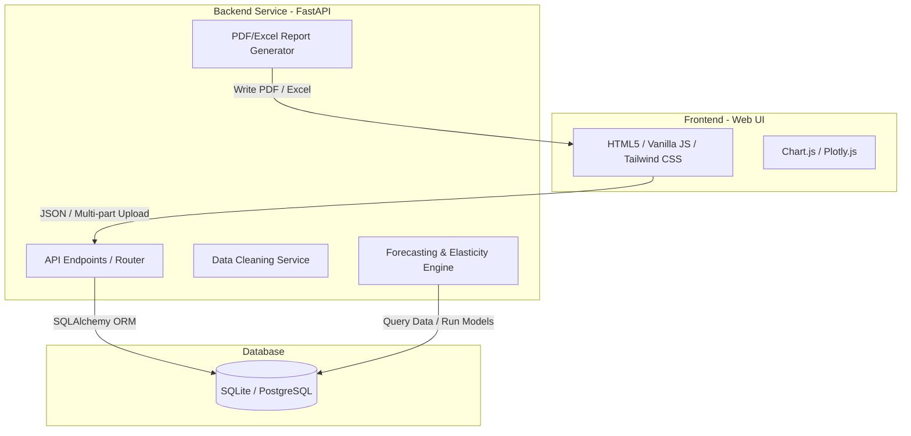
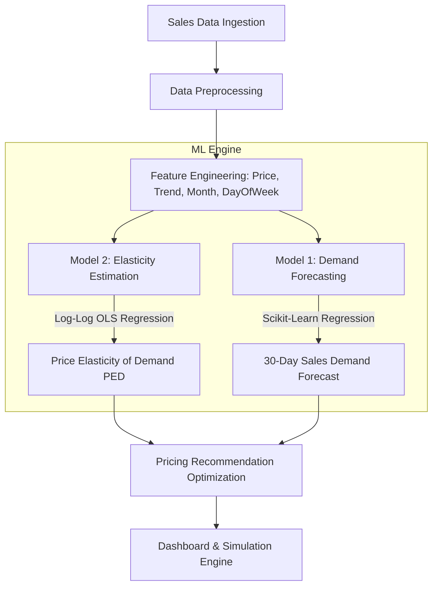

# Technical Requirements Document (TRD)
## Project: PriceSense Analytics (ML-Based Pricing Optimization & Recommendation System)

---

## 1. Architecture Overview
**PriceSense Analytics** uses a classic three-tier monolithic architecture designed for local development and academic demonstration:

The system operates as a single host application where:
* The **Frontend** is a responsive single-page web app styled with Tailwind CSS, communicating with the backend via RESTful APIs.
* The **Backend** is built on FastAPI, serving REST endpoints, executing data-cleaning services, training Scikit-Learn models, and rendering reports.
* The **Database** layer is a local SQLite database file (`pricing_ai.db`) accessed via SQLAlchemy ORM, which can scale to PostgreSQL if needed.

---

## 2. Frontend, Backend, and Database Flow

### 2.1 File Upload & Ingestion Flow
1. **User Action**: The user selects a CSV/Excel sales dataset file in the frontend and clicks "Upload".
2. **API Call**: The client issues a `POST` request to `/api/v1/upload/dataset` containing the file data as a multipart upload.
3. **Validation & Mapping**: The FastAPI backend receives the stream, reads it into a Pandas DataFrame, auto-maps columns (e.g., matching common header variations to standard schemas), and does standard cleaning (checks for non-negative values, fills empty cells).
4. **Database Commit**: Cleaned products are saved to the `products` table, and transaction records are bulk-saved to the `sales_data` table under a new `dataset_id`.
5. **Background Refresh**: Once the dataset status is marked as `"processed"`, the backend automatically updates the price elasticity calculations and pricing recommendations.

---

## 3. Machine Learning (ML) Workflow

### 3.1 Demand Forecasting Module
* **Algorithm**: Linear Regression or Random Forest Regressor from `scikit-learn`.
* **Features**: Historical quantity sold is regressed against:
  - Unit Price (current price point)
  - Time features: Month of year (1-12), Day of week (0-6), and a linear Trend indicator representing time progression.
* **Execution**: Re-trained on-demand or whenever a new dataset is processed.
* **Output**: A 30-day forecast predicting quantities sold under current prices, along with the R-squared score ($R^2$) to evaluate accuracy.

### 3.2 Elasticity Estimation Module
* **Economic Theory**: Price Elasticity of Demand (PED) measures consumer sensitivity to price changes:
  $$\text{PED} = \frac{d(\ln Q)}{d(\ln P)}$$
* **Mathematical Calculation**: A log-log regression model is fit:
  $$\ln(\text{Quantity}) = \beta_0 + \beta_1 \ln(\text{Price}) + \epsilon$$
  The coefficient $\beta_1$ directly represents the PED.
* **Logic Rules**:
  - If $\beta_1 < -1$, demand is **Elastic** (highly sensitive to price).
  - If $-1 < \beta_1 < 0$, demand is **Inelastic** (insensitive to price).
  - If $\beta_1 \approx -1$, demand is **Unitary Elastic**.
* **Fallback Strategy**: If data points are insufficient (e.g., less than 3 distinct price adjustments), the system defaults to a baseline elasticity of `-1.0` (unitary) and flags this in the recommendations.

### 3.3 Recommendation Engine
* **Objective**: Maximize revenue or maximize profit.
* **Optimization formula**:
  - **Maximize Revenue**: The optimal price $P^*$ is reached when elasticity is unitary ($PED = -1$).
  - **Maximize Profit**: Incorporating marginal cost ($MC$), the optimal price is:
    $$P^* = MC \times \left( \frac{\text{PED}}{1 + \text{PED}} \right)$$
* **Outputs**: Suggested optimal price, expected percentage shift in sales volume, expected percentage shift in profit/revenue, and reasoning text.

---

## 4. API Endpoint Structure
The backend exposes versioned API routes under `/api/v1`:

### 4.1 Authentication Modules (`/auth`)
* `POST /auth/register`: Create a new analyst account.
* `POST /auth/login`: Issue JSON Web Tokens (JWT) for authentication.
* `GET /auth/me`: Retrieve currently logged-in analyst info.

### 4.2 Dataset Upload Modules (`/upload`)
* `POST /upload/dataset`: Ingest a multi-part file, start validation/cleaning, and save records.
* `GET /upload/datasets`: Retrieve list of uploaded files and ingestion logs.

### 4.3 Dashboard Analytics Modules (`/dashboard`)
* `GET /dashboard/kpis`: Returns high-level metrics (Total Revenue, Margin, Profit, Active Products).
* `GET /dashboard/charts`: Returns aggregated trend lines, category sales share, and regional revenue distributions.
* `GET /dashboard/top-products`: Returns a list of top-performing items by profit/revenue.

### 4.4 Machine Learning Modules (`/forecasting` & `/pricing`)
* `GET /forecasting/demand/{product_id}`: Returns 30-day forecasted demand values.
* `GET /pricing/products`: List products available for pricing optimization.
* `GET /pricing/elasticity/{product_id}`: Returns elasticity score, category, and historical points.
* `GET /pricing/recommendations`: Fetch all generated optimal prices and justifications.
* `POST /pricing/simulate`: Run price-quantity scenario simulation.

### 4.5 Report Generation Modules (`/reports`)
* `GET /reports/pdf`: Generate and stream a PDF summary brief.
* `GET /reports/excel`: Generate and stream an Excel data sheet.

---

## 5. Tech Stack Justification

| Layer | Technology | Justification |
| :--- | :--- | :--- |
| **Frontend** | HTML5, CSS3, JS (ES6), Tailwind CSS | Tailwind CSS offers rapid layout building. Vanilla JS avoids node build steps, ensuring files load directly in modern web browsers. |
| **Backend** | FastAPI, Uvicorn | High performance, automatic Swagger/OpenAPI docs generation, and seamless integration with Python ML tools. |
| **Database** | SQLite, SQLAlchemy ORM | SQLite is serverless and works as a single local file, avoiding database installations. SQLAlchemy handles queries cleanly. |
| **Machine Learning** | Pandas, NumPy, Scikit-Learn | Pandas handles data cleaning/reshaping; Scikit-Learn provides stable regression tools for demand forecasting. |
| **Data Viz** | Chart.js / Plotly.js | Client-side plotting libraries that keep the payload light and charts interactive. |
| **Reporting** | ReportLab (PDF), OpenPyXL (Excel) | ReportLab allows programmatically compiling PDF briefs; OpenPyXL offers fine-grained control over Excel cells. |

---

## 6. Architecture & Deployment Overview
* **No Docker/Kubernetes**: Designed to run directly on Python 3.10+ environments.
* **No Caching/Task Queues**: Avoids Celery or Redis. Background tasks are handled directly by FastAPI's native `BackgroundTasks` library.
* **Single-Server Deployment**: Can be run locally using `uvicorn main:app` and opened directly in a browser.
